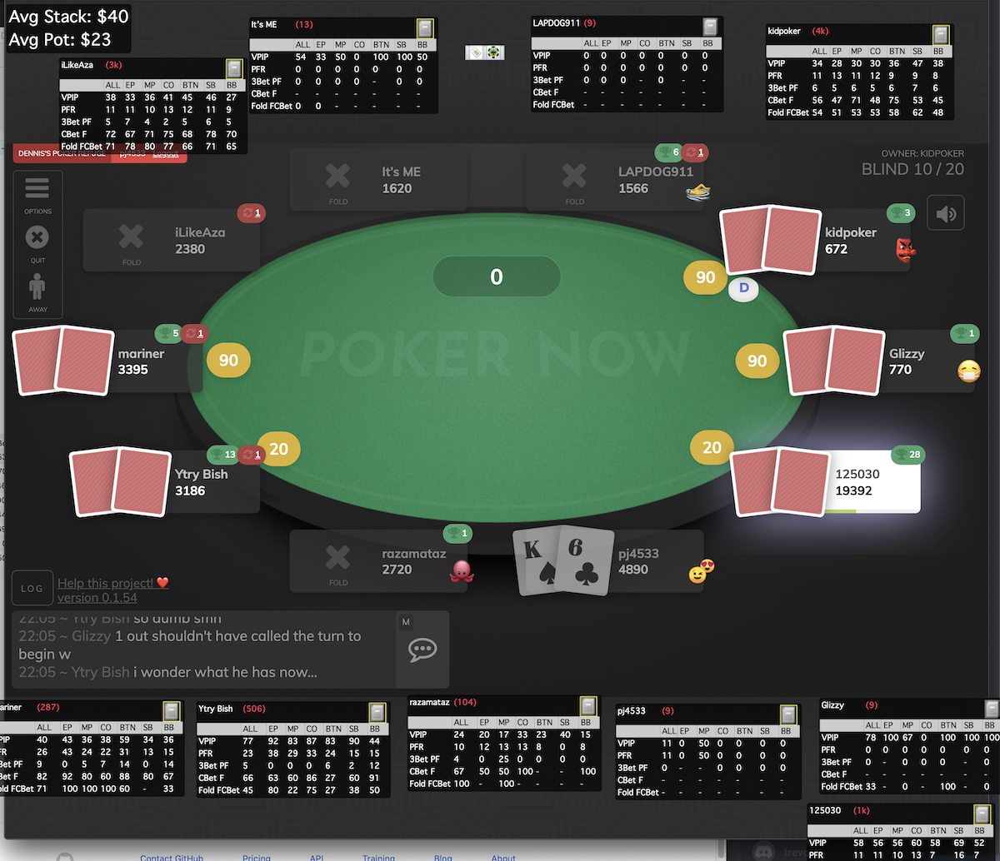

# PokerNowGrabber    

Save hand histories while you play PokerNow.club

### What

PokerNowGrabber will connect to a PokerNow.club table and watch the action via the websocket.  When a hand is over, it downloads the log, converts it to PokerStars format and saves it to a directory.  

Also, PokerNowGrabber looks for your browser window (Chrome only for now), and overlays a transparent window.  This transparent window allows utilities such as [PokerTracker](https://www.pokertracker.com) or [Holdem Manager](https://www.holdemmanager.com/hm3/) to show a heads up display.  These HUDs can be customized with whatever statistics the user wishes by PokerTracker or Holdem Manager.  All PokerNowGrabber does is save the data and provide a 'fake' window.

### How To Run

1. Download the [latest release](https://github.com/pj4533/PokerNowGrabber/releases).
2. Run (might need to give permission)
3. Enter your name used
4. Enter the URL of the game
5. Enter both cookies (see below)
6. Enter the hand history folder
7. Click start

### How to get cookies

The connection to the websocket requires knowing the cookies you are currently using in your browser.  These identify you, so dont share with anyone else, but you can view your own cookies and enter them in the app.  PokerNowGrabber is open source so you can see I am not storing or transmitting the cookies.   

I use a Chrome cookie manager called [EditThisCookie](https://editthiscookie.com), which can be downloaded from the Chrome web store.  Once you added that, just open it from your PokerNow.club game and copy the `npt` cookie (and `dpt` cookie for Discord games).  

### Limitations

* Mac only for now
* Single table only for now

